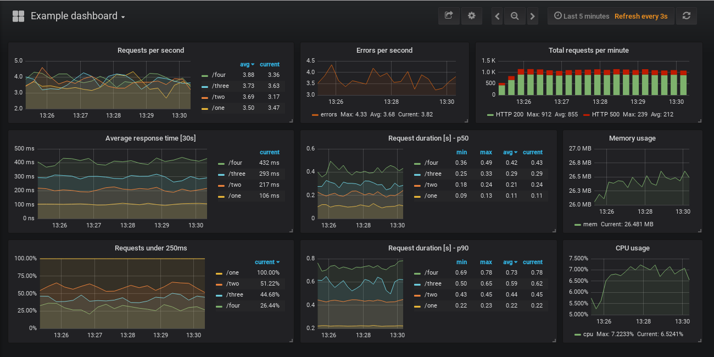

# Prometheus Flask exporter

[](https://travis-ci.org/rycus86/prometheus_flask_exporter)
[](https://pypi.python.org/pypi/prometheus-flask-exporter)
[](https://pypi.python.org/pypi/prometheus-flask-exporter)
[](https://coveralls.io/github/rycus86/prometheus_flask_exporter?branch=master)
[](https://codeclimate.com/github/rycus86/prometheus_flask_exporter)

This library provides HTTP request metrics to export into
[Prometheus](https://prometheus.io/).
It can also track method invocations using convenient functions.

## Usage

```python
from flask import Flask, request
from prometheus_flask_exporter import PrometheusMetrics

app = Flask(__name__)
metrics = PrometheusMetrics(app)

# static information as metric
metrics.info('app_info', 'Application info', version='1.0.3')

@app.route('/')
def main():
    pass  # requests tracked by default

@app.route('/skip')
@metrics.do_not_track()
def skip():
    pass  # default metrics are not collected

@app.route('/<item_type>')
@metrics.do_not_track()
@metrics.counter('invocation_by_type', 'Number of invocations by type',
         labels={'item_type': lambda: request.view_args['type']})
def by_type(item_type):
    pass  # only the counter is collected, not the default metrics

@app.route('/long-running')
@metrics.gauge('in_progress', 'Long running requests in progress')
def long_running():
    pass

@app.route('/status/<int:status>')
@metrics.do_not_track()
@metrics.summary('requests_by_status', 'Request latencies by status',
                 labels={'status': lambda r: r.status_code})
@metrics.histogram('requests_by_status_and_path', 'Request latencies by status and path',
                   labels={'status': lambda r: r.status_code, 'path': lambda: request.path})
def echo_status(status):
    return 'Status: %s' % status, status
```

## Default metrics

The following metrics are exported by default
(unless the `export_defaults` is set to `False`).

- `flask_http_request_duration_seconds` (Histogram)
  Labels: `method`, `path` and `status`.
  Flask HTTP request duration in seconds for all Flask requests.
- `flask_http_request_total` (Counter)
  Labels: `method` and `status`.
  Total number of HTTP requests for all Flask requests.
- `flask_exporter_info` (Gauge)
  Information about the Prometheus Flask exporter itself (e.g. `version`).

## Configuration

By default, the metrics are exposed on the same Flask application on the
`/metrics` endpoint and using the core Prometheus registry.
If this doesn't suit your needs, set the `path` argument to `None` and/or
the `export_defaults` argument to `False` plus change the `registry`
argument if needed. The `group_by_endpoint` constructor flag makes
the default request duration metric tracked by endpoint (function)
instead of URI path.

The `register_endpoint` allows exposing the metrics endpoint on a specific path.
It also allows passing in a Flask application to register it on but defaults
to the main one if not defined.

Similarly, the `start_http_server` allows exposing the endpoint on an
independent Flask application on a selected HTTP port.
It also supports overriding the endpoint's path and the HTTP listen address.

## Labels

When defining labels for metrics on functions,
the following values are supported in the dictionary:

- A simple static value
- A no-argument callable
- A single argument callable that will receive the Flask response
  as the argument

Label values are evaluated within the request context.

## Application information

The `PrometheusMetrics.info(..)` method provides a way to expose
information as a `Gauge` metric, the application version for example.

The metric is returned from the method to allow changing its value
from the default `1`:

```python
metrics = PrometheusMetrics(app)
info = metrics.info('dynamic_info', 'Something dynamic')
...
info.set(42.1)
```

## Examples

See some simple examples visualized on a Grafana dashboard by running
the demo in the [examples/sample-signals](https://github.com/rycus86/prometheus_flask_exporter/tree/master/examples/wsgi) folder.



## App Factory Pattern

This library also supports the flask [app factory pattern](http://flask.pocoo.org/docs/1.0/patterns/appfactories/). Use the `init_app` method to attach the library to one or more application objects. Note, that to use this mode, you'll need to pass in `None` for the `app` in the constructor.

```python
metrics = PrometheusMetrics(app=None, ...)
# then later:
metrics.init_app(app)
```

## Debug mode

Please note, that changes being live-reloaded, when running the Flask
app with `debug=True`, are not going to be reflected in the metrics.
See [https://github.com/rycus86/prometheus_flask_exporter/issues/4](https://github.com/rycus86/prometheus_flask_exporter/issues/4)
for more details.

## WSGI

Getting accurate metrics for WSGI apps might require a bit more setup.
See a working sample app in the `examples` folder, and also the
[prometheus_flask_exporter#5](https://github.com/rycus86/prometheus_flask_exporter/issues/5) issue.

## License

MIT
